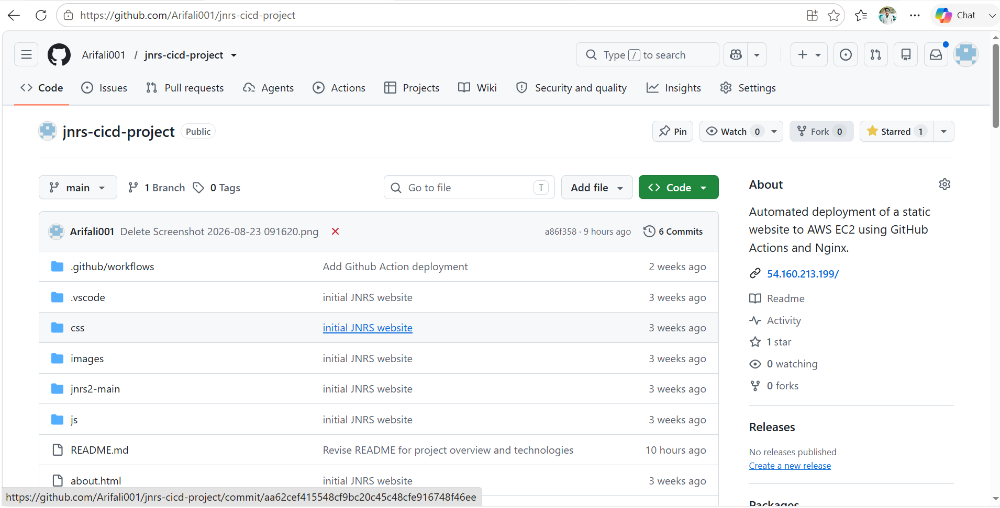
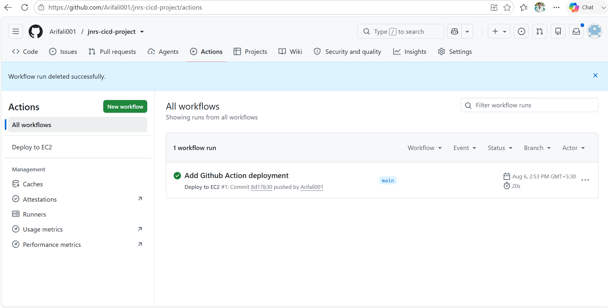
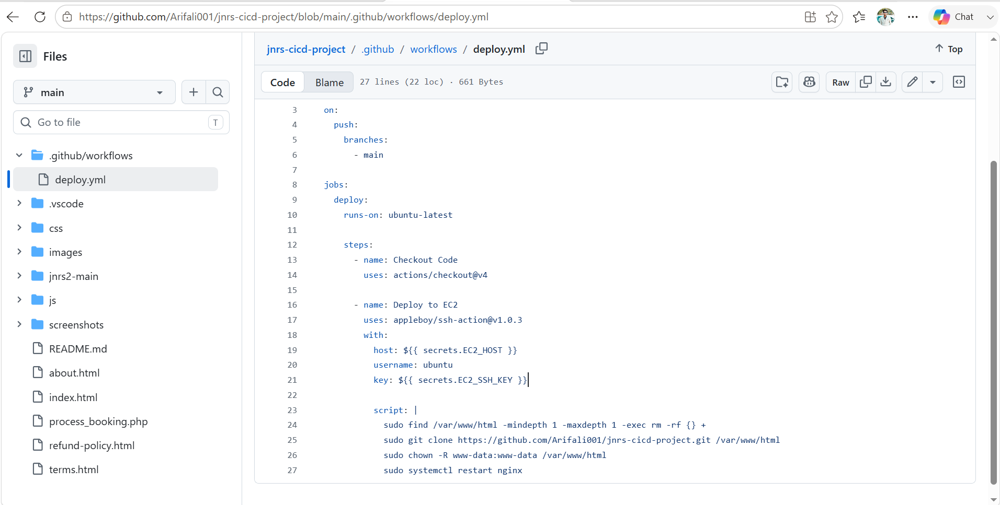
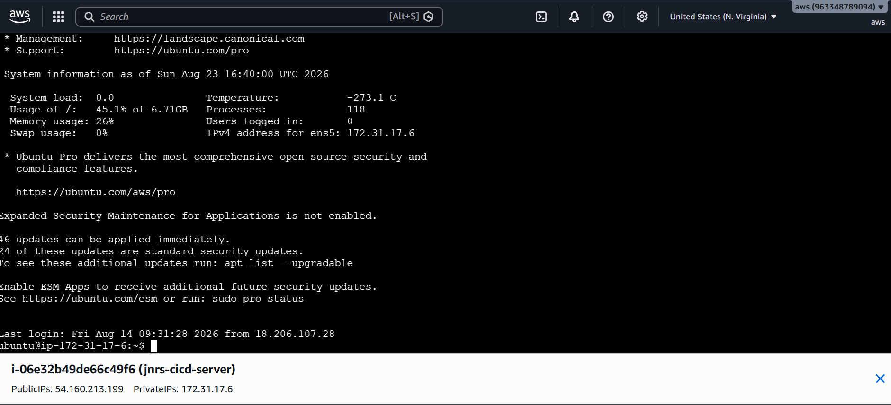
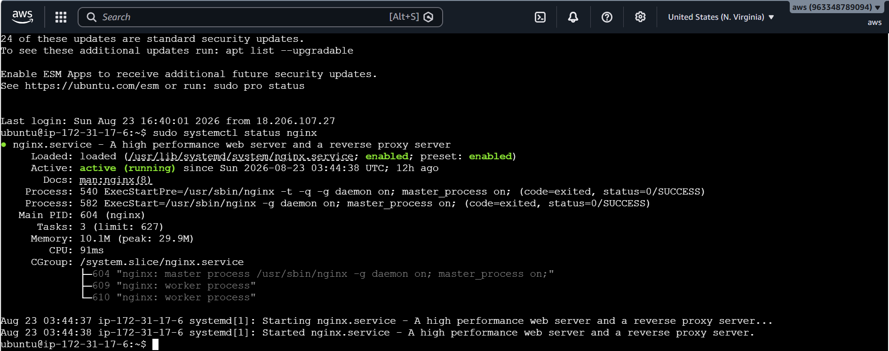

# 🚀 CI/CD Pipeline using GitHub Actions and AWS EC2

## About the Project

In this project, I created a simple CI/CD pipeline to automatically deploy a website to an AWS EC2 Ubuntu server.

The website is developed using HTML, CSS and JavaScript. GitHub Actions is used to automate the deployment process whenever new code is pushed to the GitHub repository.

## Technologies Used

- HTML
- CSS
- JavaScript
- Git
- GitHub
- GitHub Actions
- AWS EC2
- Ubuntu
- Nginx

## How the Project Works

Whenever I make changes to the website and push the code to GitHub, GitHub Actions starts the deployment workflow.

The workflow connects to the AWS EC2 server and updates the website files. Nginx then serves the updated website.

## CI/CD Flow

Developer
   ↓
Git
   ↓
GitHub
   ↓
GitHub Actions
   ↓
AWS EC2
   ↓
Nginx
   ↓
Live Website

## What I Did

- Created a website using HTML, CSS and JavaScript.
- Created a GitHub repository.
- Hosted the website on an AWS EC2 Ubuntu server.
- Installed and configured Nginx.
- Created a GitHub Actions workflow.
- Added EC2 connection details as GitHub Secrets.
- Configured automatic deployment to EC2.
- Tested the pipeline by pushing code changes.
- Verified that the updated website was deployed successfully.

## CI/CD Pipeline

The GitHub Actions workflow performs the deployment automatically after code is pushed to the repository.

Workflow file:

`.github/workflows/deploy.yml`

## AWS EC2 Configuration

- Operating System: Ubuntu
- Web Server: Nginx
- HTTP Port: 80
- SSH Port: 22

## Security

Sensitive information such as SSH private keys and credentials are stored in GitHub Secrets and are not included in the source code.

## Result

The website is successfully deployed to AWS EC2 through a GitHub Actions CI/CD pipeline.

## What I Learned

- Git and GitHub
- GitHub Actions
- CI/CD concepts
- AWS EC2
- Ubuntu/Linux
- SSH
- Nginx
- Automated deployment
- GitHub Secrets

## Future Improvements

- Add HTTPS using SSL/TLS
- Add a custom domain
- Add automated testing
- Add AWS CloudWatch monitoring
- Improve the deployment pipeline

  ## Project Screenshots

### GitHub Repository

### GitHub Actions Pipeline

### Deployment Workflow

### AWS EC2 Instance

### Website Running on EC2

### Nginx Server

